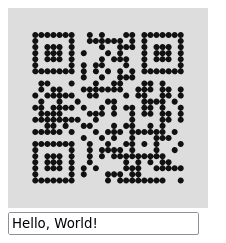

# [Leptos](https://leptos.dev/) QR Code Component Library

This library provides a simple QR code component based on [`fast_qr`](https://github.com/erwanvivien/fast_qr). You can customize the pixel shape, color and error correction level.

See the [examples](examples/csr/src/main.rs) for more information on how to use it.

```html
<QrCode
    data="Hello, World!"
    ecl=leptos_qr::ECL::Q
    shape=leptos_qr::Shape::Circle
    fg_color="#111111"
    bg_color="#dddddd"
/>
```

